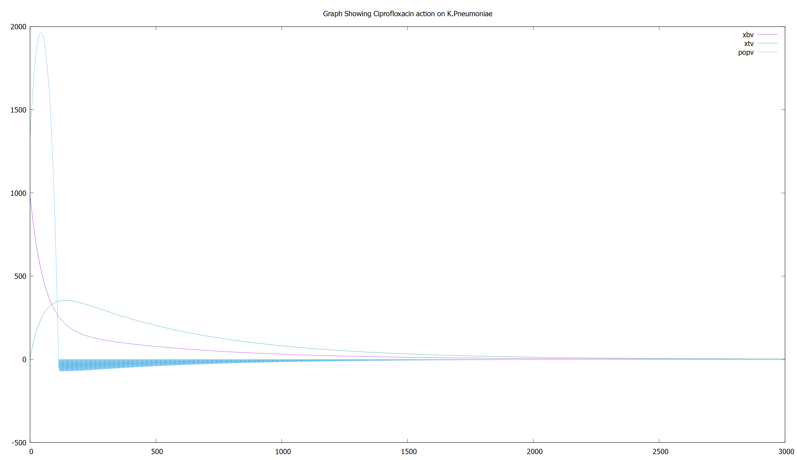

# Pharmacodynamic Model of Ciprofloxacin Action against Klebsiella Pneumonoae

### Introduction
*Klebsiella pneumoniae** is a gram-negative, encapsulated, non-motile bacterium found in the environment and has been associated with pneumonia in patient populations with alcohol use disorder or diabetes mellitus. 
The bacterium typically colonizes human mucosal surfaces of the oropharynx and gastrointestinal (GI) tract[[1]](#1).
Once the bacterium enters the body, it can display high degrees of virulence and antibiotic resistance. 
Today, *K. pneumoniae** pneumonia is considered the most common cause of hospital-acquired pneumonia in the United States, and the organism accounts for 3% to 8% of all nosocomial bacterial infections.

### Ideas
It is key to develop a great mathematical model to describe the growth of *K.Pneumoniae** bacteria in the body.
Major assumptions have to be made aligning to present pharmaceutical studies done of the bacterium.
- The test subject of our model is at 37 degrees celcius.
- The bacteria shows no antibiotic resistance.
- Drug absorpion by all peripheral organs is similar and constant.

### Result

This image shows a sample result. Values can be corrected to the bacteria strain and the MIC and MBC of the drug.

### Tools Used in the Analysis

- C++ and STL
- Gnuplot
- Visual Studio 2022

### References

<a id="1">[1]</a> Ashurst, J. V., & Dawson, A. (2021). Klebsiella Pneumonia, StatPearls.

<a id="2">[2] </a> Wentland, E. J., Stewart, P. S., Huang, C. T., & McFeters, G. A. (1996). Spatial variations in growth rate within Klebsiella pneumoniae colonies and biofilm. Biotechnology progress, 12(3), 316–321. https://doi.org/10.1021/bp9600243